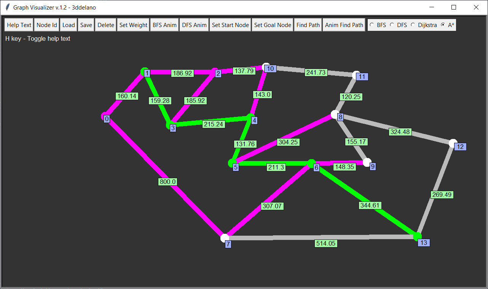
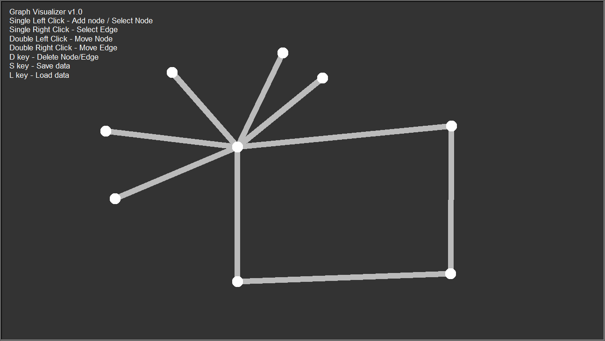

graph-visualizer-python
=========================================

### GUI tool visualize graphs and traversal algorithms (Python, Turtle and Tk)

 
 

  

Features
--------------

- Load / Save to csv
- Find path / Animate path
- Quick keyboard shortcuts
- Easily add more features
- Separated GUI from Graph data
- Uses inheritance and interfaces (see `/uml`)

Previous Versions
--------------

### v.1.0 (See [v1 branch](https://github.com/3ddelano/graph-visualizer-python/tree/v1))

Support the development
--------------

Want to support in other ways? Contact me on Discord: `@3ddelano#6033`

For doubts / help / bugs / problems / suggestions do join: [3ddelano Cafe](https://discord.gg/FZY9TqW)
